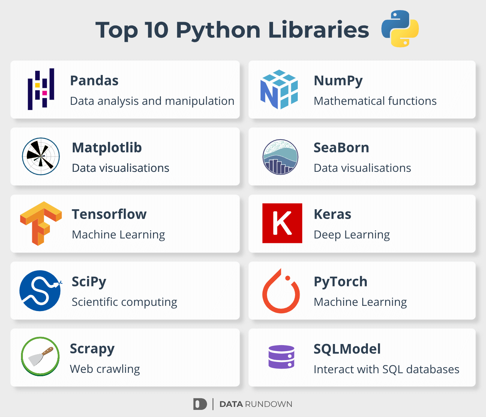

# 📚 Python Libraries Notebooks & Hands-On Projects


Welcome to my **Python Libraries Notebooks** repository! 🚀  
In this space, I'll be sharing Jupyter Notebooks packed with notes, practice questions, and hands-on projects using some of the most popular and powerful Python libraries. Whether you're a beginner or looking to deepen your knowledge, there's something here for everyone.

## 🛠️ Libraries Covered
Explore detailed notebooks and projects for the following libraries:

- **NumPy** - Fundamental package for scientific computing with Python
- **Pandas** - Data manipulation and analysis made easy
- **Matplotlib** - Comprehensive library for creating static, animated, and interactive visualizations
- **Seaborn** - Statistical data visualization built on top of Matplotlib
- **TensorFlow** - End-to-end open-source machine learning platform
- **PyTorch** - Deep learning framework that accelerates research
- **Scikit-learn** - Machine learning in Python with simple and efficient tools
- **Keras** - High-level neural networks API running on top of TensorFlow
- **Requests** - Simple HTTP library for making network requests

…and more to come!



## 🎓 What You'll Find Here
- 📘 **Detailed Notes**: Each notebook includes clear explanations and documentation to help you understand the concepts behind each library.
- 💡 **Practice Questions**: Sharpen your skills with well-thought-out practice exercises.
- 🖥️ **Hands-On Projects**: Apply what you've learned to real-world problems with practical coding projects.

## 🚀 Why This Repository?
This repo is designed to help you **learn by doing**. By walking through these notebooks, you'll be able to:
- Understand the core features of essential Python libraries
- Solve real-world problems using Python
- Build projects that reinforce your knowledge

## 🧠 Who Is This For?
- **Beginners** looking to get started with Python libraries
- **Developers** seeking to deepen their understanding of data analysis, machine learning, and visualization
- **Learners** who enjoy working through guided projects and hands-on examples

## 🎯 How to Use This Repository
1. Clone the repository:
   ```bash
   git clone https://github.com/wasif-h/your-repo-name.git
   ```
2. Navigate to a notebook and start exploring:
   ```bash
   cd your-repo-name
   jupyter notebook
   ```

## 💡 Keep Learning, Keep Growing!
I’ll keep updating this repo with new content, so feel free to star ⭐ the repository to stay up to date.  
If you find something useful, don't hesitate to share it with others!

Happy learning! 😊

---


**Author : Wasif Hossain**

Email  : wasif.hx@gmail.com
Data   : 15 Sep, 2024
